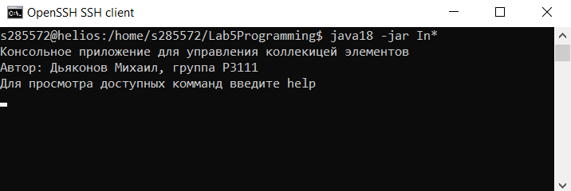

# ConsoleAppLab5
ITMO programming, Laboratory work 5

#### Task

Реализовать консольное приложение, которое реализует управление коллекцией объектов в интерактивном режиме. В коллекции необходимо хранить объекты класса _StudyGroup_, описание которого приведено ниже.

**Разработанная программа должна удовлетворять следующим требованиям:**
- Класс, коллекцией экземпляров которого управляет программа, должен реализовывать сортировку по умолчанию.
- Все требования к полям класса (указанные в виде комментариев) должны быть выполнены.
- Для хранения необходимо использовать коллекцию типа _java.util.LinkedHashSet_
- При запуске приложения коллекция должна автоматически заполняться значениями из файла.
- Имя файла должно передаваться программе с помощью: _переменная окружения_.
- Данные должны храниться в файле в формате _xml_
- Чтение данных из файла необходимо реализовать с помощью класса _java.io.InputStreamReader_
- Запись данных в файл необходимо реализовать с помощью класса _java.io.FileOutputStream_
- Все классы в программе должны быть задокументированы в формате javadoc.
- Программа должна корректно работать с неправильными данными (ошибки пользовательского ввода, отсутсвие прав доступа к файлу и т.п.).

**В интерактивном режиме программа должна поддерживать выполнение следующих команд:**
- ***help*** : вывести справку по доступным командам
- ***info*** : вывести в стандартный поток вывода информацию о коллекции (тип, дата инициализации, количество элементов и т.д.)
- ***show*** : вывести в стандартный поток вывода все элементы коллекции в строковом представлении
- ***add {element}*** : добавить новый элемент в коллекцию
- ***update id {element}*** : обновить значение элемента коллекции, id которого равен заданному
- ***remove_by_id id*** : удалить элемент из коллекции по его id
- ***clear*** : очистить коллекцию
- ***save*** : сохранить коллекцию в файл
- ***execute_script file_name*** : считать и исполнить скрипт из указанного файла. В скрипте содержатся команды в таком же виде, в котором их вводит пользователь в интерактивном режиме.
- ***exit*** : завершить программу (без сохранения в файл)
- ***add_if_max {element}*** : добавить новый элемент в коллекцию, если его значение больше, чем у наибольшего элемента этой коллекции
- ***add_if_min {element}*** : добавить новый элемент в коллекцию, если его значение меньше, чем у наименьшего элемента этой коллекции
- ***history*** : вывести последние 9 команд (без их аргументов)
- ***sum_of_students_count*** : выведет сумму значений поля studentsCount для всех элементов коллекции
- ***filter_starts_with_name name*** : вывести элементы, значение поля name которых начинается с заданной подстроки
- ***filter_greater_than_students_count studentsCount*** : выведет элементы, значение поля studentsCount которых больше заданного

**Result**

**Acquired skills:**
- Collection API
- Generics
- Wrappers classes
- IO and NIO
- Javadoc