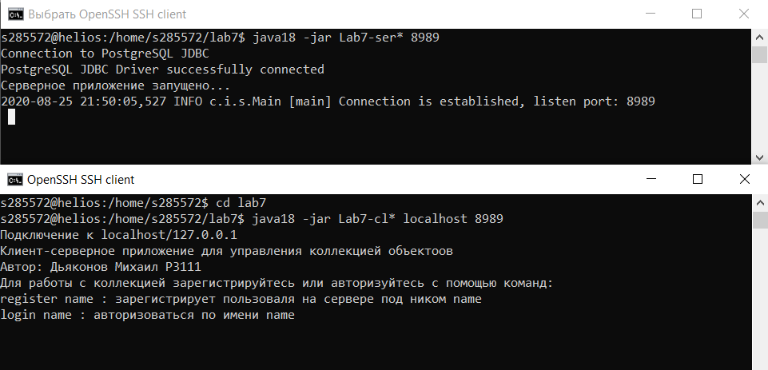

# Lab7
ITMO Programming Lab7

#### Task

**Доработать программу из лабораторной работы №6 следующим образом:**
- Организовать хранение коллекции в реляционной СУБД (PostgresQL). Убрать хранение коллекции в файле.
- Для генерации поля id использовать средства базы данных (sequence).
- Обновлять состояние коллекции в памяти только при успешном добавлении объекта в БД
- Все команды получения данных должны работать с коллекцией в памяти, а не в БД
- Организовать возможность регистрации и авторизации пользователей. У пользователя есть возможность указать пароль.
- Пароли при хранении хэшировать алгоритмом _SHA-256_
- Запретить выполнение команд не авторизованным пользователям.
- При хранении объектов сохранять информацию о пользователе, который создал этот объект.
- Пользователи должны иметь возможность просмотра всех объектов коллекции, но модифицировать могут только принадлежащие им.
- Для идентификации пользователя отправлять логин и пароль с каждым запросом.

**Необходимо реализовать многопоточную обработку запросов:**
- Для многопоточного чтения запросов использовать _Fixed thread pool_
- Для многопотчной обработки полученного запроса использовать создание нового потока (_java.lang.Thread_)
- Для многопоточной отправки ответа использовать создание нового потока (_java.lang.Thread_)
- Для синхронизации доступа к коллекции использовать потокобезопасные аналоги коллекции из _java.util.concurrent_

**Result**

**Acquired skills:**
- Multithreading in Java
- java.util.concurrent
- JDBC
- PostgreSQL
- GoF Patterns
